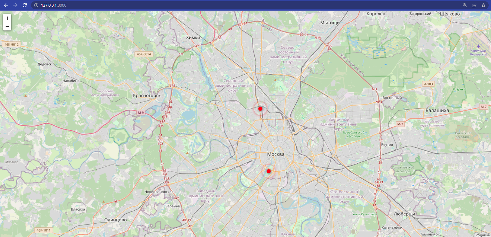

# Interactive map

Interactive map of Moscow. The online version of the [site](https://vladislavdrag.pythonanywhere.com/) is on [pythonanywhere](https://www.pythonanywhere.com/).

## How to install

- Сlone this repository:
```bash
git clone git@github.com:MaxHC-vlop/interactive_map.git
```
- You must have python3.9 (or higher) installed.

- Create a virtual environment on directory project:
```bash
python3 -m venv env
 ```
- Start the virtual environment:
```bash
. env/bin/activate
```
- Then use pip to install dependencies:
```bash
pip install -r requirements.txt
```
- Create .env file (next to the manage.py file):
```bash
cd where_to_go

touch .env
```
- Create a database:
```bash
python manage.py migrate
```
- Сreate an application administrator:
```bash
python manage.py createsuperuser
```

- Fill the .env file with the following variables (help [here](https://docs.djangoproject.com/en/4.1/ref/settings/)):

```
# Django secret key
SECRET_KEY='123'

# Use true or false for switch debug mode
DEBUG='True'

# A list of strings representing the host/domain names that this Django site can serve
ALLOWED_HOSTS='127.0.0.1'

# Database location
DATABASE_FILEPATH='db.sqlite3'
```

- Load data with places(data can be found [here](https://github.com/devmanorg/where-to-go-places)):
```bash
python manage.py load_place url_1 url_2
```

## Run

```bash
python manage.py runserver
```
- Go to link http://127.0.0.1:8000 and you will see:
